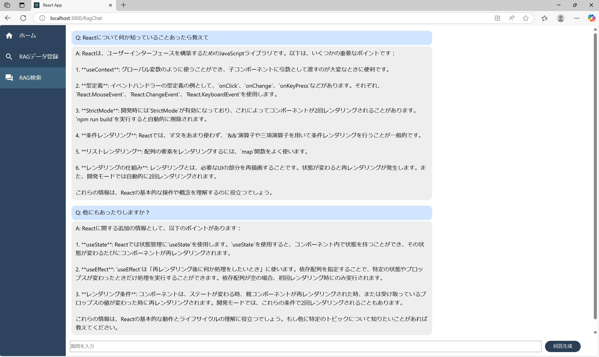

# RAG UI sample

これは RAG の UI サンプルです。  
React×Typescript での実装となります。



# バックエンド

下記の Django のバックエンドとセットとなる
https://github.com/takuya-fukuda/rag-research

# 起動方法

```
npm start
```

# フォルダ説明

| アプリルート             | 概要説明                               |
| ------------------------ | -------------------------------------- |
| /pages                   | アプリケーションルート先のファイル     |
| /components/ragchat      | RagChat 画面の部品格納先               |
| /components/dataregister | RagDataregister の部品格納先           |
| /components/layout       | 画面共通レイアウト用の部品が入っている |
| /hooks/                  | API などの関数格納先                   |
